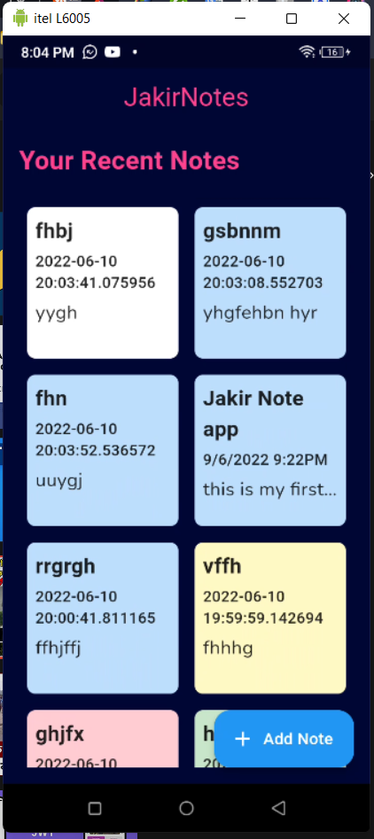
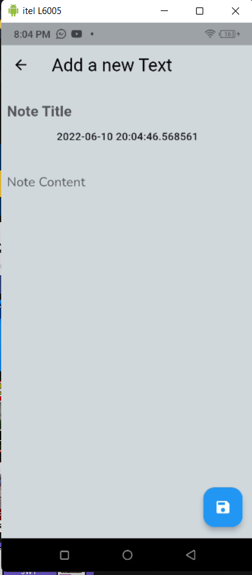
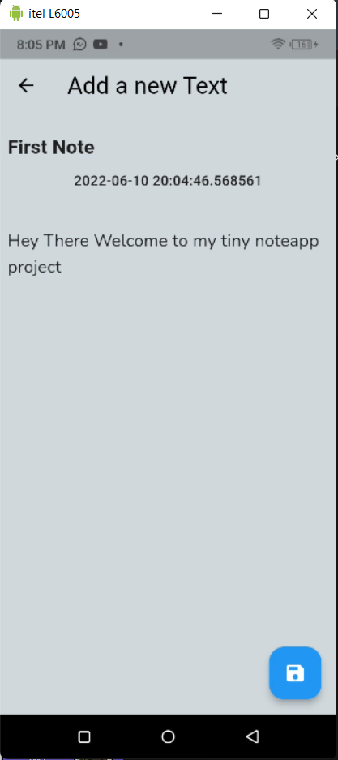

# Jakir's Note
Create a simple notes

## Features

* simple interface that most of the users find easy to use
* no limits on note's length or number of notes (of course there's a limit to phone's storage)
* creating and editing text notes
* importing notes from txt files, saving notes as txt files
* sharing notes with other apps (e.g. sending a note in Gmail)

## Screenshots

   

## Try out BookMyBus?

Android: [Download BookMyBus.apk](https://github.com/mhnabilcoder/Bus_Ticket_Booking_App_Flutter-UI/blob/main/App/Book%20My%20Bus.apk)

## Developer

Hello,I'm an intermediate level Flutter Developer from Bangladesh.I'm interested to work on various sectors but love to work in mobile application development.Photography & traveling are my favorite things to do. 
If you have any query related to it don't hasitate to [e-mail me](mailto:syedjakir7890@gmail.com). And also check out my other stuffs [here](https://github.com/syedjakir7890).
